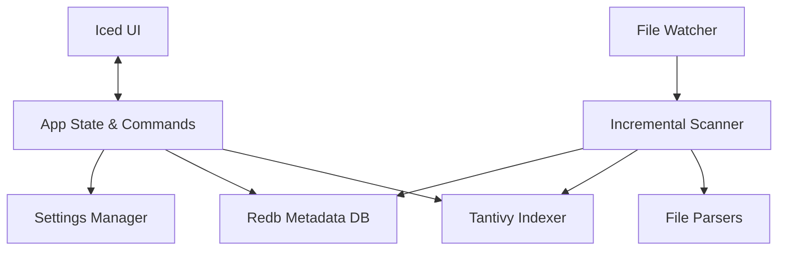

# Flash Search Architecture

This document provides a high-level overview of the components that make up Flash Search.

## Architecture Diagram

## Core Components

1. **Iced UI (`src/iced_ui/`)**: The presentation layer built with the Iced GUI framework. It runs on the main thread and communicates with the backend `AppState` asynchronously through messages and background tasks.

2. **App State & Commands (`src/commands/`)**: Coordinates tasks between the UI and the underlying engines. It holds shared references to the Indexer, Metadata Database, and Settings, and exposes asynchronous methods for searching, pinning, and other actions.

3. **Indexer (`src/indexer/`)**: A wrapper around the `tantivy` search engine. It defines the document schema, handles queries (including boolean searches and filtering), and manages the index writer for adding or removing documents.

4. **Parsers (`src/parsers/`)**: Extracts plain text from various document formats (PDF, DOCX, XLSX, etc.). They execute in a Rayon thread pool to keep CPU-bound parsing off the main async loops.

5. **Metadata DB (`src/metadata/`)**: A fast, embedded pure-Rust key-value store using `redb`. It tracks the last modified time and indexing status of every file, enabling the app to quickly determine if a file needs re-indexing without opening it.

6. **File Watcher (`src/watcher.rs`)**: Uses the `notify` crate to listen to OS-level file system events (creates, writes, deletes) on watched directories, and feeds them to the scanner.

7. **Scanner (`src/scanner/`)**: Crawls folders, cross-references with the Metadata DB, dispatches modified files to the Parsers in parallel, and finally commits the extracted text to the Indexer.
